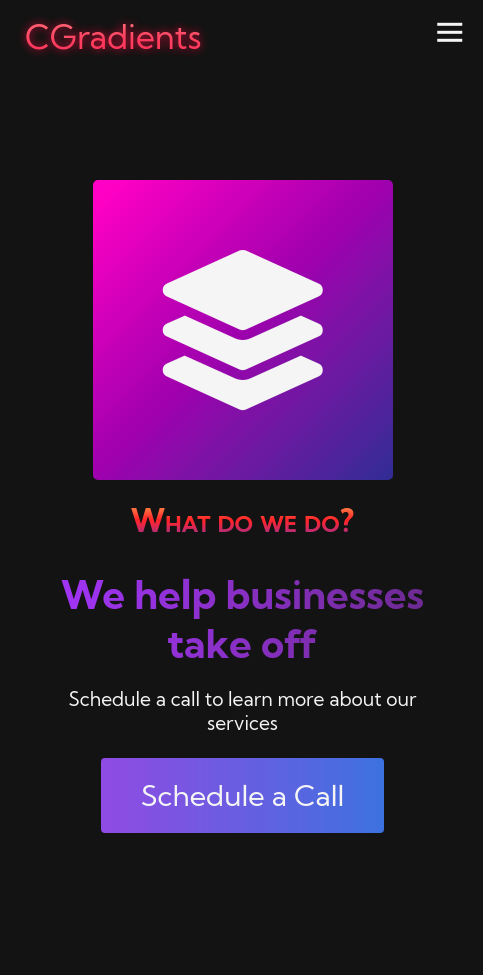
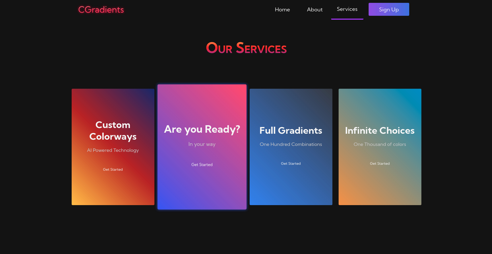

# Collor Gradients

## about
Collor Gradients - was a project created with HTML5, CSS3 and JavaScript to put most of the things I've learned so far into practice. Made from uigradients.com gradients, it's a website for a supposed gradient company.
I tried hard to make the HTML as semantic and cohesive as possible, and to make it well styling and beautiful, putting my knowledge of grid, flex, animations, media queries... to the test, and I used JavaScript to put the finishing touches on it.

## Result

Access the project <a href="https://luk4x.github.io/project-collor/">HERE</a>

## Contributors Contact
<table>
  <tr>
    <td align="center">
      <a href="https://www.linkedin.com/in/lucasmacielf/">
         
        
          <b>Lucas Maciel</b>
        
      </a>
    </td>
  </tr>
</table>
